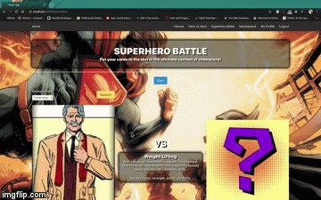
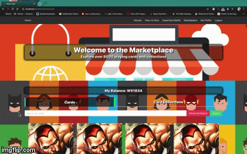
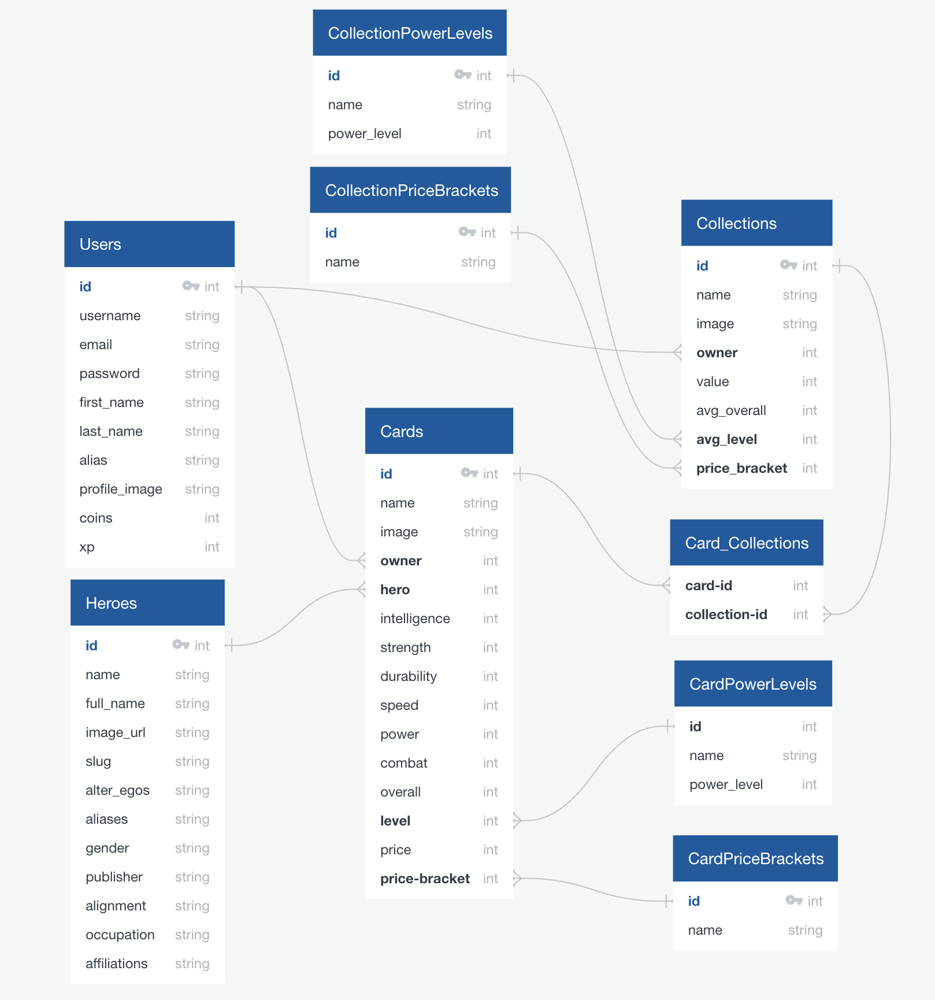

#  SEI45 - Project 04 (Fullstack Django App)
My fourth and final project for the General Assembly Software Engineering Immersive course. A fullstack web application built in Django, PostgreSQL and ReactJS. This is an expansion of my [second project](https://github.com/bheki-maenetja/sei-project-2) for the course.

## Getting Started
### Installation
- Clone this repository by running the terminal command `git clone git@github.com:bheki-maenetja/sei-project-4.git`
- In the root folder run the terminal command `pipenv shell`
- In the root folder run the terminal commands `yarn` and `pipenv install` to install all necessary packages and modules
- To view the site locally run the terminal command `python manage.py runserver` and navigate to localhost:8000 in your browser

### Deployment
- You can view a deployed version of the site [here](https://my-superhero-app-v2.herokuapp.com/)

## Technologies Used
- Python 3
- Django
- PostgreSQL
- ReactJS
- JavaScript (ES6)
- HTML 5
- CSS 3
- Bulma CSS Framework
- Yarn
- Axios
- Third-party APIs
  * [SuperHero API](https://akabab.github.io/superhero-api/api/)

## Overview
This project is a superhero information website. Users can search for their favourite superheroes (or supervillains) and find a wealth of information about their origins, connections, occupations and so much more. The site also includes a nifty comparison tool that allows users to compare the power stats of different superheroes. Additionally, the site also features a top-trumps-style card game where users can compare the power stats of their cards against other users and win prizes in the process. Cards (as well as card collections) can be purchased at the marketplace.

<figcaption>Home Page</figcation>


<figcaption>Suphero Battle</figcaption>


<figcaption>The Marketplace</figcation>


<figcaption>A User's Profile Page</figcation>


## Development
Given the fact that this project is an expansion of [sei-project-2](https://github.com/bheki-maenetja/sei-project-2) it does use many of the same technologies; especially on the frontend. The big difference is that this project includes a backend built with Django and PostgreSQL. The frontend is still built with ReactJS and includes additional components for features such as the card game and marketplace.

### The Backend
- The backend is comprised of a PostgreSQL database hosted on a Django server. The server-side language used for all backend functionality is python. There are 8 models in the database. These models are stored within 4 django apps: cards, cardCollections, heroes and jwt_auth.
- Whilst the data needed for card collections and users was created manually, cards and heroes were populated with the use of the [SuperHero API](https://akabab.github.io/superhero-api/api/) published by [Yoann Criber](https://github.com/akabab). A python script was used to make requests to the API. The response data was then refactored into either hero or card models and then posted to the database.

```
# Making seeds for superheroes

import json 
from urllib import request, error

my_list = []

banned_publishers = [
  'NBC - Heroes',
  'SyFy',
  'South Park',
  'ABC Studios',
  'Universal Studios'
]

def make_model(json_dict):
  new_model = {
    "model": "heroes.hero",
    "pk": json_dict['id'],
    "fields": {
      "name": json_dict['name'],
      "full_name": json_dict['biography']['fullName'],
      "image_url": json_dict['images']['lg'],
      "slug": json_dict['slug'],
      "alter_egos": json_dict['biography']['alterEgos'],
      "aliases": '+'.join(json_dict['biography']['aliases']),
      "gender": json_dict['appearance']['gender'],
      "publisher": json_dict['biography']['publisher'],
      "alignment": json_dict['biography']['alignment'],
      "occupation": json_dict['work']['occupation'],
      "affiliations": json_dict['connections']['groupAffiliation']
    }
  }

  return new_model

res = request.urlopen('https://cdn.rawgit.com/akabab/superhero-api/0.2.0/api/all.json')
data = json.loads(res.read())
my_list = [make_model(item) for item in data if item['biography']['publisher'] not in banned_publishers]

with open('heroes/seeds.json', 'w') as outfile:
  json.dump(my_list, outfile, indent=2)
```

<figcaption>The Entity Relationship Diagram (ERD) for the Database</figcation>


### Playing Cards & Superhero Battle
- One of the major features of the site is superhero playing cards. The site contains over 8000 playing cards based on 542 superheroes from the [SuperHero API](https://akabab.github.io/superhero-api/api/). Playing cards have dynamic power stats, meaning an individual card can have it's power stats levelled up. Playing cards are classified into one of five power levels and one of five price brackets; a card's classification is determined by its power stats.
- Superhero Battle is a top-trumps style card game. It works much the same way as the superhero comparison tool but, unlike the comparison tool, the game only compares specific power stats. All the functionality for the game during gameplay is done on the frontend. When the game is finished an API request is made to update the winning playing card and the user's account.
```
# Levelling Up Playing Cards

class LevelUpCard(APIView):
  
  def update_stats(self, card_dict):
    base_prices = {1: 100, 2: 200, 3: 400, 4: 800, 5: 1600}

    intelligence = card_dict['intelligence']
    strength = card_dict['strength']
    durability = card_dict['durability']
    speed = card_dict['speed']
    combat = card_dict['combat']
    power = card_dict['power']

    overall = int((intelligence + strength + durability + speed + combat + power) / 6)

    if overall >= 90: power_level = 5
    elif 90 > overall >= 70: power_level = 4
    elif 70 > overall >= 50: power_level = 3
    elif 50 > overall >= 30: power_level = 2
    else: power_level = 1

    price = base_prices[power_level] + (5 * max([intelligence, strength, durability, speed, combat, power]))

    if price >= 2000: price_bracket = 5
    elif 2000 > price >= 1500: price_bracket = 4
    elif 1500 > price >= 1000: price_bracket = 3
    elif 1000 > price >= 500: price_bracket = 2
    else: price_bracket = 1

    power_level = CardPowerLevel.objects.get(power_level=power_level).id
    price_bracket = CardPriceBracket.objects.get(value=price_bracket).id

    card_dict.update({
      'level': power_level,
      'price_bracket': price_bracket,
      'overall': overall,
      'price': price
    })

    return card_dict

  def put(self, request, pk):
    chosen_card = PlayingCard.objects.get(pk=pk)
    card_data = PlayingCardSerializer(chosen_card).data

    card_data.update(request.data)
    card_data = self.update_stats(card_data)
    updated_card = PlayingCardSerializer(chosen_card, data=card_data)
    if updated_card.is_valid():
      updated_card.save()
      return Response(updated_card.data, status=HTTP_202_ACCEPTED)
    return Response({'message: SOMETHING IS VERY WRONG!!!'}, HTTP_406_NOT_ACCEPTABLE)
```

```
// Frontend Game functionality

refreshGame = async () => {
    try {
      const res = await Promise.all([
        axios.get('/api/cards/', {
          timeout: 100000
        }),
        axios.get('/api/users/my-profile/', {
          headers: {
            Authorization: `Bearer ${Authorize.getToken()}`
          }
        })
      ])
      const chosenChallenge = this.state.battleChallenges[Math.floor(Math.random() * this.state.battleChallenges.length)]
      const compCards = res[0].data.filter(card => !card.owner || card.owner.username === 'admin')
      const playerCards = res[1].data.cards
      this.setState({ 
        userInfo: res[1].data, 
        compCards, playerCards, 
        playerChoice: playerCards[0],
        chosenChallenge
      })
    } catch(err) {
      console.log(err)
    }
  }

  endGame = async () => {

    const { winner, playerWinnings, playerChoice, cardLevelUp } = this.state
    
    this.setState({
      userInfo: null,
      playerCards: [],
      compCards: null,
      playerChoice: [],
      compChoice: null,
      gameInPlay: false,
      isModalOpen: false,
      chosenChallenge: [],
      winner: '',
      playerWinnings: null,
      cardLevelUp: null
    })

    const playerDataJSON = JSON.stringify(playerWinnings)

    if (winner === 'playerChoice') {
      try {
        await Promise.all([
          axios.get('/api/users/my-profile/update/', { 
            headers: {
              Authorization: `Bearer ${Authorize.getToken()}`,
              playerData: playerDataJSON
            },
          }),
          axios.put(`/api/cards/${playerChoice.id}/level-up/`, cardLevelUp)
        ])
        this.refreshGame()
        return
      } catch (err) {
        console.log(err.response)
      }
    }

    this.refreshGame()
  }

  completeGame = () => {
    let cardLevelUp, cardAttrs, playerWinnings
    const { winner, playerChoice, chosenChallenge, userInfo } = this.state

    if (winner === 'playerChoice') {
      cardAttrs = chosenChallenge.attributes.map(attr => [attr, playerChoice[attr] + 2])
      cardLevelUp = Object.fromEntries(cardAttrs)
      playerWinnings = {
        coins: userInfo.coins + 20,
        xp: userInfo.xp + 50
      }
      this.setState({ playerWinnings, cardLevelUp, isModalOpen: true })
    }

    this.setState({ isModalOpen: true })
  }
  
  handleChange = (e) => {
    const heroChoice = this.state.playerCards.filter(item => item.id === parseInt(e.target.value))[0]
    this.setState({ [e.target.name]: heroChoice })
  }

  getRandomHero = (e) => {
    e.preventDefault()
    const heroChoice = this.state.playerCards[Math.floor(Math.random() * this.state.playerCards.length)]
    this.setState({ [e.target.name]: heroChoice })
  }

  getRandomCompCard = () => {
    let compHero
    const { playerChoice, compCards } = this.state
    const viableHeroes = compCards.filter(card => Math.abs(card.overall - playerChoice.overall) <= 5 && card.name !== playerChoice.name )
    if (viableHeroes.length > 0) compHero = viableHeroes[Math.floor(Math.random() * viableHeroes.length)]
    else compHero = compCards[Math.floor(Math.random() * compCards.length)]
    return compHero
  }

  setChallenge = () => {
    const compChoice = this.getRandomCompCard()
    this.setState({ compChoice, gameInPlay: true })
  }

  findWinner = () => {
    const { playerChoice, compChoice, chosenChallenge } = this.state
    let playerTotal = 0
    let compTotal = 0

    chosenChallenge.attributes.map(attr => {
      playerTotal += playerChoice[attr]
      compTotal += compChoice[attr]
    })

    playerTotal /= chosenChallenge.attributes.length
    compTotal /= chosenChallenge.attributes.length

    if (playerTotal > compTotal) this.setState({ winner: 'playerChoice' })
    else if (compTotal > playerTotal) this.setState({ winner: 'compChoice' })
    else this.setState({ winner: 'Draw' })
  }
```

### The Marketplace
- All playing cards and card collections have a market value. Users can purchase cards and collections at the marketplace. All users that sign up will be given W$500 to start with. Users can make money by winning games in Suphero Battle or through the buying and selling of cards/collections.
- Transactions are handled in the backend. A complete transaction requires two things: the id of the buyer or seller and the market value of the card or card collection. In the event of a purchase a verfication check is made to ensure the buyer can afford to make the purchase. If that is the case then the buyer is debitted the value of the card/collection. The owner field of the card/collection is then set to the buyer's id; when buying a collection the owner field of each card will be set to the buyer's id. When a sale is made the seller is credited the market value of the card/collection; the owner field of the card/collection is set to the admin user's id.
```
# Buying and Selling Cards

class BuySingleCard(APIView):

  permission_classes = (IsAuthenticatedOrReadOnly, )

  def get(self, request, pk):
    buyer = User.objects.get(pk=request.user.id)
    buyer_data = UserSerializer(buyer).data

    chosen_card = PlayingCard.objects.get(pk=pk)
    card_data = PlayingCardSerializer(chosen_card).data

    if buyer_data['coins'] >= card_data['price'] and card_data['owner'] != buyer.id:
      buyer_data['coins'] -= card_data['price']
      card_data['owner'] = buyer.id
    elif card_data['owner'] == buyer.id:
      return Response({'message: You already own that card'}, status=HTTP_200_OK)
    else: 
      return Response({'message: You can\'t afford that mate'}, status=HTTP_406_NOT_ACCEPTABLE)
    
    updated_buyer = UserSerializer(buyer, data=buyer_data)
    updated_card = PlayingCardSerializer(chosen_card, data=card_data)
    if updated_buyer.is_valid(): 
      updated_buyer.save()
      if updated_card.is_valid():
        updated_card.save()
      return Response(updated_card.data, status=HTTP_200_OK)
    
    return Response({'message: SOMETHING IS VERY WRONG!!!'}, status=HTTP_422_UNPROCESSABLE_ENTITY)

class SellSingleCard(APIView):

  permission_classes = (IsAuthenticated, )

  def get(self, request, pk):
    admin = User.objects.get(username='admin')
    seller = User.objects.get(pk=request.user.id)
    seller_data = UserSerializer(seller).data

    token = request.headers.get('Authorization')
    print(token)

    chosen_card = PlayingCard.objects.get(pk=pk)
    card_data = PlayingCardSerializer(chosen_card).data

    if card_data['owner'] == seller.id: seller_data['coins'] += card_data['price']
    else: return Response({'message': 'UNAUTHORIZED!!! GET OUT OF HERE!!!'})
    card_data['owner'] = admin.id

    for coll_Id in seller_data['collections']:
      put_res = requests.get(
        url = f'http://localhost:8000/api/collections/{coll_Id}/remove-card/', 
        json={'cardIds': [chosen_card.id]}, 
        headers={
          'Authorization': token
        }
      )

    updated_seller = UserSerializer(seller, data=seller_data)
    updated_card = PlayingCardSerializer(chosen_card, data=card_data)

    if updated_card.is_valid():
      updated_card.save()
      if updated_seller.is_valid():
        updated_seller.save()
      return Response(updated_seller.data, status=HTTP_200_OK)

    return Response({'message: SOMETHING IS VERY WRONG!!!'}, status=HTTP_422_UNPROCESSABLE_ENTITY)


class ManyCards(APIView):

  def get(self, _request):
    my_cards = PlayingCard.objects.all()
    serial_cards = PopulatedCardSerializer(my_cards, many=True)
    return Response(serial_cards.data, status=HTTP_200_OK)
  
  def post(self, request):
    self.request.POST._mutable = True

    request.data.hero = Hero.objects.get(pk=request.data['hero']).id
    request.data.level = CardPowerLevel.objects.get(power_level=request.data['level']).id
    request.data.price_bracket = CardPriceBracket.objects.get(value=request.data['price_bracket']).id

    new_card = PlayingCardSerializer(data=request.data)
    if new_card.is_valid():
      new_card.save()
      return Response(new_card.data, status=HTTP_201_CREATED)
    return Response(new_card.errors, status=HTTP_422_UNPROCESSABLE_ENTITY)
```

## Reflection
### Challenges
- **Model relationships:** there are number of relationships between models in the database. The user model has relationships with the models for cards and card collections. Cards, in turn, have relationships with card collections, power levels, price brackets and heroes. Model relationships became even more complicated when implementing functionality for the purchase and sale of cards/collections. Implementing all these relationships was a laborious task.
- **Authenticated API requests:** in the website certain API requests require the token that a user is given when they log in to the site; e.g. buying and selling cards. These requests work perfectly when made from a REST client such as Insomnia. However, when made from a browser the requests return a 403 error. It took me a while to figure out that the backend was not receiving the user's token in the correct format.

### Room for Improvement
- **Design & Styling:** there are a few layouting issues on the marketplace and superhero battle pages. Overall, the styling can be improved with a more focused colour palette and perhaps a few animations. The responsive design of the site also needs work.
- **Request Timeouts:** on the deployed version of the site, user's are unable to access the marketplace and the card game. The sheer number of cards that need to be pulled from the database (over 8000) means that the necessary data for the marketplace and card game cannot be accessed before the request times out. There are a number of possible fixes including limiting the number cards that are pulled in a request or pulling cards by category instead of all at once.

## Future Features
- **Super Teams:** as was the case in [sei-project-2](https://github.com/bheki-maenetja/sei-project-2), one MVP feature that I couldn't quite get to in the given time frame was Super Teams. This would've been an extension of the superhero comparision tool. Users would be able to assemble teams of heroes and compare their cumulative powerstats against one another. This would've also been included in Superhero Battle; users would be able to duel with multiple cards at once.


